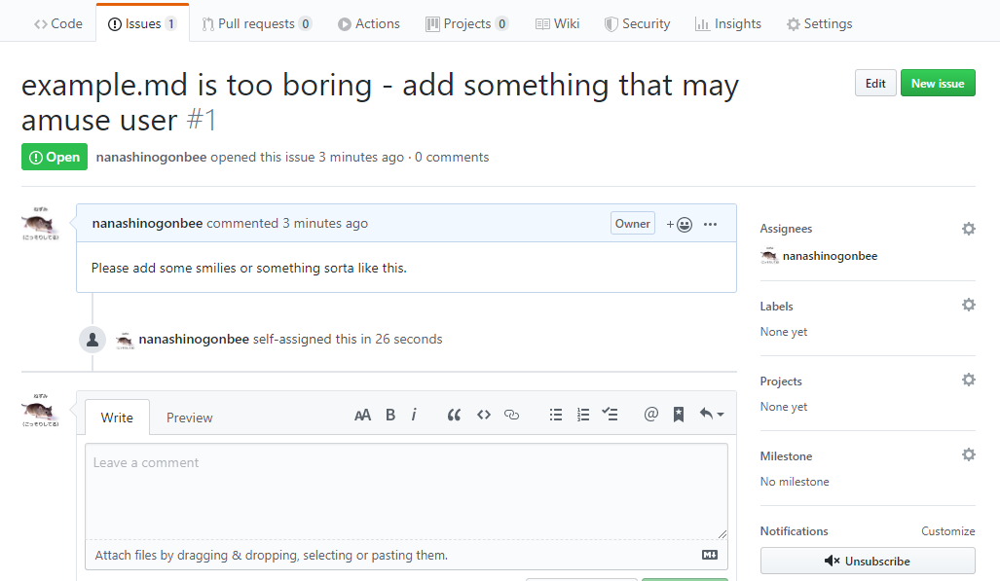
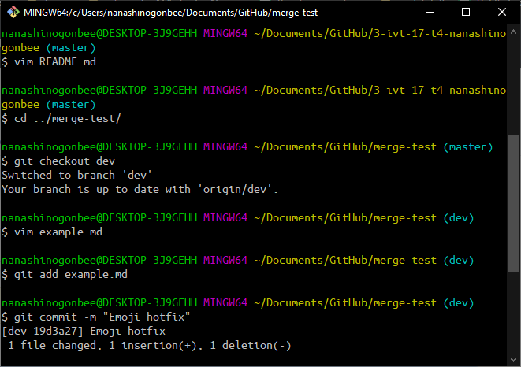
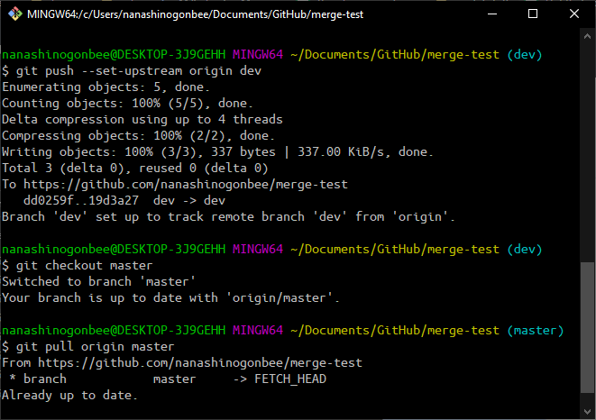
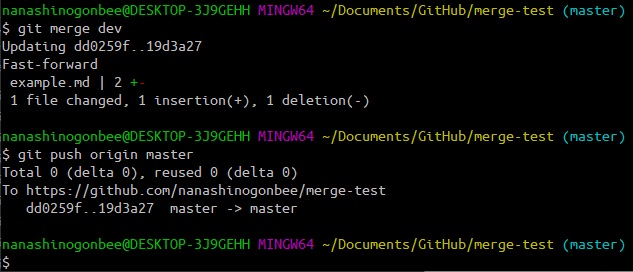
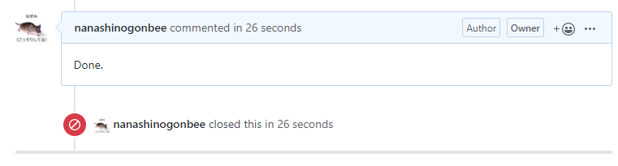
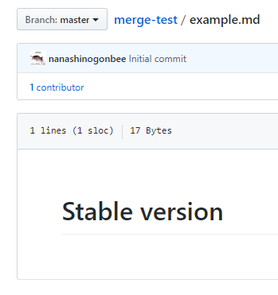
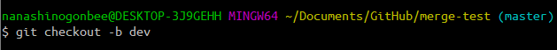
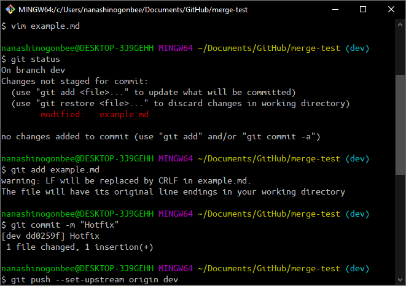
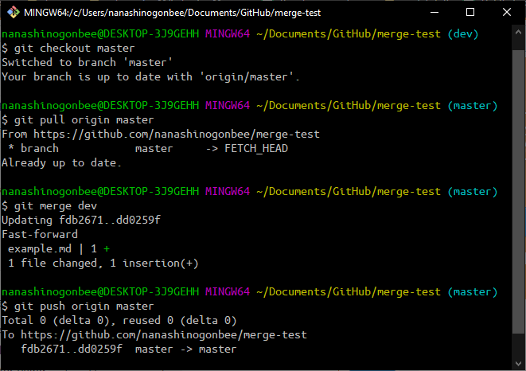

# 3-ivt-17-t4
Тема 4. 3ИВТ/17

# ИСР
## Задание 4.1
Добавление issue

Реализация необходимого функционала из issue, коммит в ветку dev

Push в ветку dev, переход в ветку master

Слияние изменений с веткой dev

Закрытие issue

## Задание 4.2
[Отчёт](https://drive.google.com/file/d/1U1I0WzEniMVsxoPViWiKBODrmIsEAf4G/view?usp=sharing)

# ВСР
## Задание 4.1
Стабильная версия в ветке master

Создание ветки dev

Редактирование файла, commit и push в ветку dev

Переход в ветку master, слияние изменений с веткой dev

